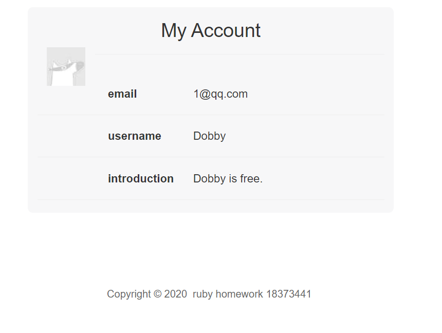
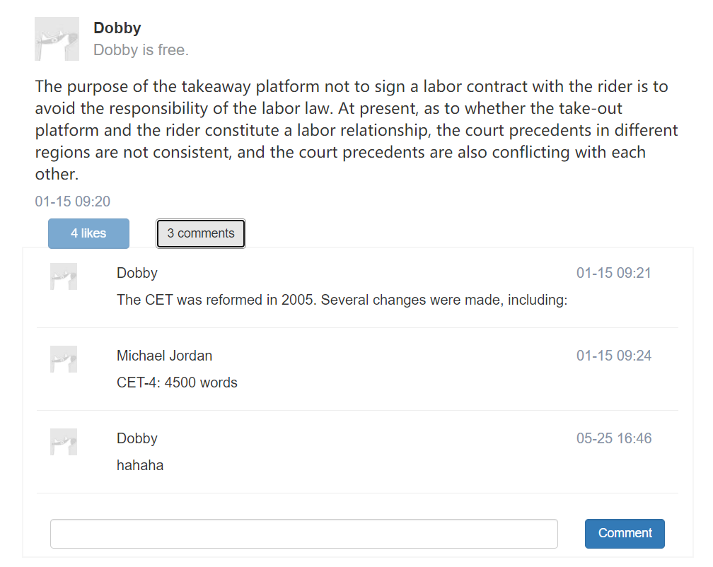
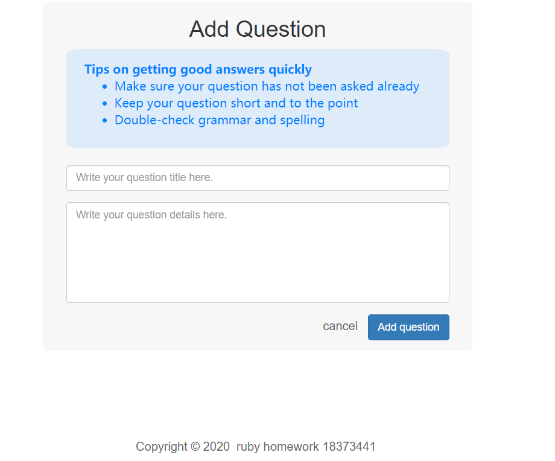
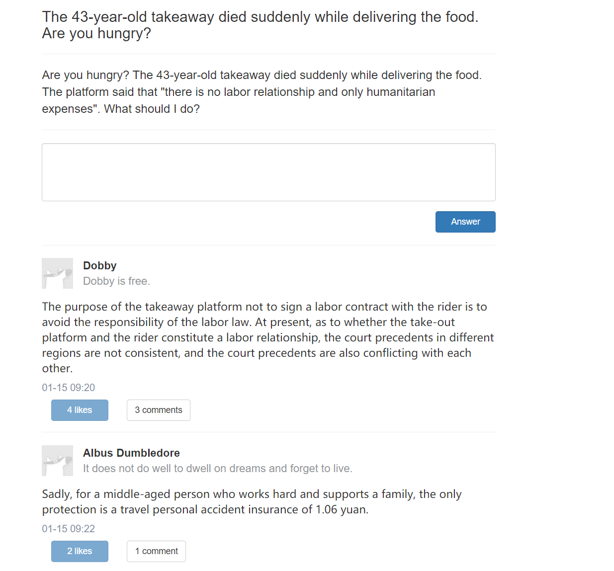
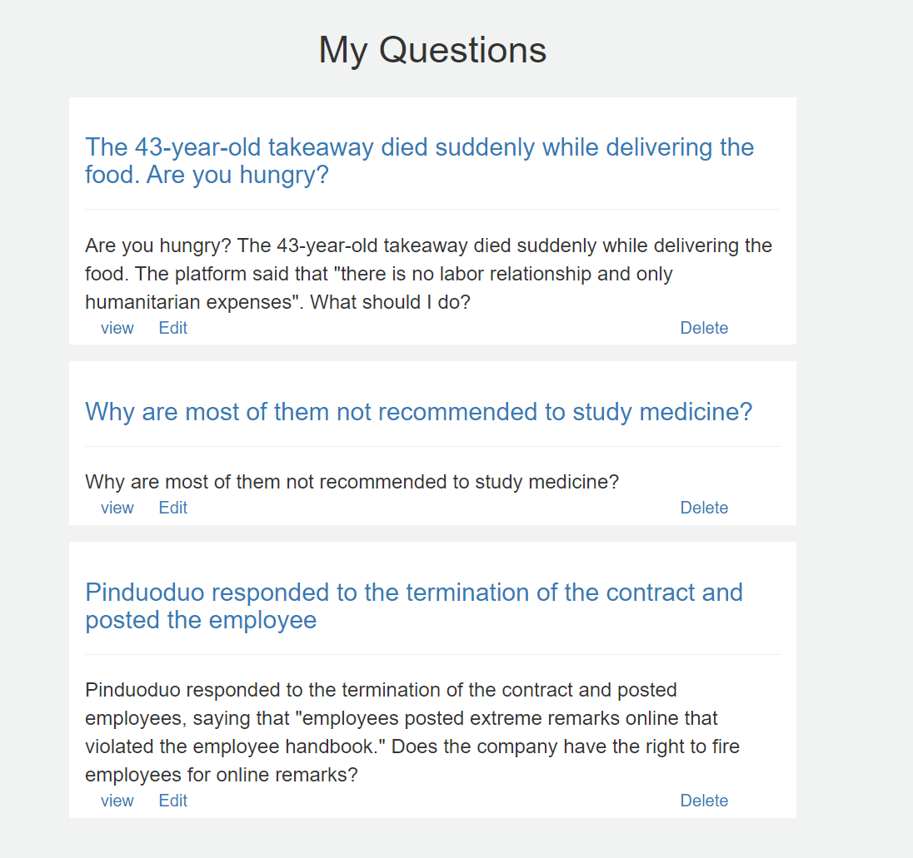
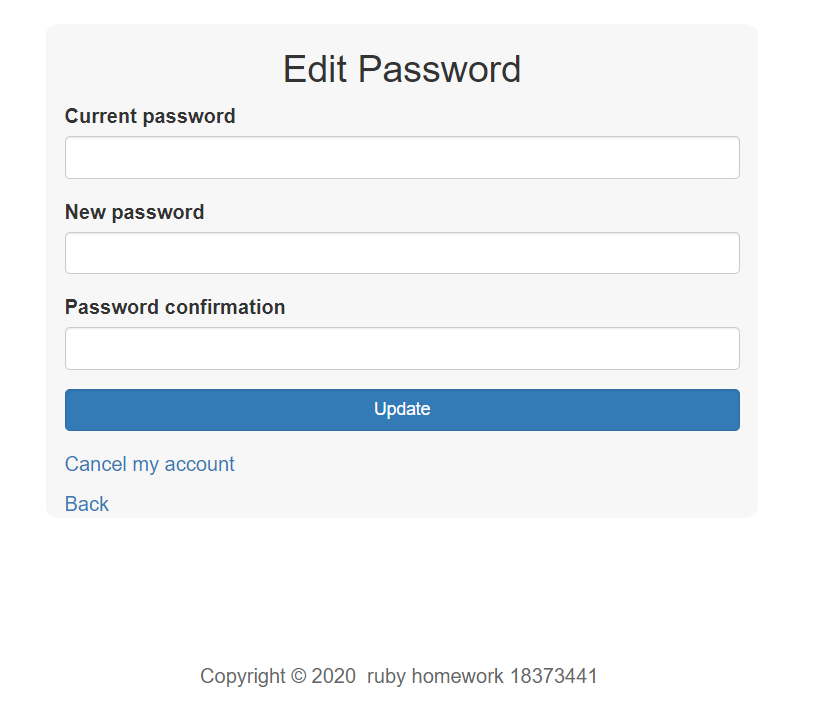

# 问答平台Quore

## 项目简介

Quore

开发一个类似于知乎和Quora的web应用:Quore。

https://stark-springs-40328.herokuapp.com

## 软件环境

ruby on rails5

SQLite/PostgreSQL

前端使用bootstrap


## 实体

包括4个实体和1个关系实体：

4个实体：

* 用户、问题、回答、评论

1个关系实体：

* 点赞

#### 中文

用户

```
id，用户名，密码，昵称，邮箱，头像URL
```

问题

```
id，标题，内容，分类，发表时间，用户id
```

回答

```
id，内容，发表时间，用户id，问题id
```

评论

```
id，内容，发表时间，用户id，问题id
```

点赞

```
id,用户id,回答id
```

#### 英文

user

```
id,email,username,password,introduction
```

question

```ruby
id,title,content,#user_id
```

answer

```ruby
id,content,#user_id,question_id
```

comment

```ruby
id,content,#user_id,answer_id
```

like

```ruby
id,#user_id,answer_id
```

## 操作

登录、注册、退出

查看账号信息、修改密码、注销账号

查看所有问题、发布问题、回答问题、评论回答、给回答点赞

查看自己发布的问题

## 效果展示

登录


个人主页



回答和评论



添加问题



问题界面



我的问题



修改密码




## 已有的数据库

#### 账号信息

已有4名用户

分别是1@qq.com, 2@qq.com, 3@qq.com, 4@qq.com, 

他们的密码都是111111(6个1)


数据库中已经有了他们的一些信息

#### 用户信息

##### Harry Potter

1

Dobby

Dobby is free.


2

Albus Dumbledore

It does not do well to dwell on dreams and forget to live.

##### NBA

3

Stephen Curry

Curries are the fulcrum of the Indian meal. 


4

Michael Jordan

Talent wins games, but teamwork and intelligence wins championships.

#### 问题

##### 外卖员

The 43-year-old takeaway died suddenly while delivering the food. Are you hungry?

Are you hungry? The 43-year-old takeaway died suddenly while delivering the food. The platform said that "there is no labor relationship and only humanitarian expenses". What should I do?


The purpose of the takeaway platform not to sign a labor contract with the rider is to avoid the responsibility of the labor law. At present, as to whether the take-out platform and the rider constitute a labor relationship, the court precedents in different regions are not consistent, and the court precedents are also conflicting with each other.


Sadly, for a middle-aged person who works hard and supports a family, the only protection is a travel personal accident insurance of 1.06 yuan.


How does fantasy 996 end?  Sorry, 996 will never end on its own

##### 学医

Why are most of them not recommended to study medicine?

Why are most of them not recommended to study medicine?


It is really difficult for medical students to move! Wailing others come out to walk the dog And I came out to walk the bones!


Not only more lessons, but more knowledge points It's a test of your mind A knowledge point of photobiochemistry So that beginners want to hit the wall


Money is the real confidence. The high professional salary and the large amount of money are sent to your own pocket.


##### 拼多多

Pinduoduo responded to the termination of the contract and posted the employee

Pinduoduo responded to the termination of the contract and posted employees, saying that "employees posted extreme remarks online that violated the employee handbook." Does the company have the right to fire employees for online remarks?


Regarding the facts of the case, the parties have already explained in detail in the video.And because arbitration is going to be carried out, I will not comment too much on this case.


I think, Pinduoduo always makes me cut and cut. Let people chop at every turn. After cutting one knife after another, Too bloody, It's too extreme.


On the evening of January 10, Wang Mou, an employee of Pinduoduo, posted a video on Weibo, claiming that he had been fired from the company for posting anonymously in Maimai that "employees of Pinduoduo were carried into an ambulance".

##### 其他问题

随便复制，主要来自维基百科-四六级https://en.wikipedia.org/wiki/College_English_Test